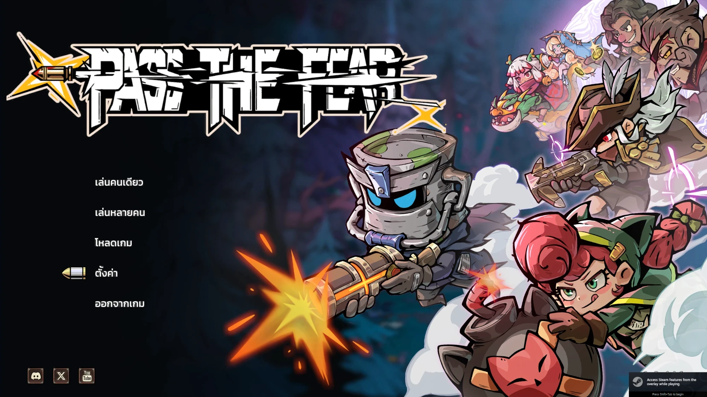

# Pass the Fear — ม็อดภาษาไทย

ม็อดแปลไทยแบบไม่เป็นทางการสำหรับ **[Pass the Fear](https://store.steampowered.com/app/3561220/)** บน Steam

**แปลครบทั้งเกม 4,285 บรรทัด** · ดาวน์โหลดได้ที่ [Releases](https://github.com/krirk0137/PassTheFearModThai/releases)

[](https://youtu.be/rhaQT3z0-iY)

▶️ **[ดูคลิปตัวอย่างในเกม](https://youtu.be/rhaQT3z0-iY)**

> ⚠️ **รุ่นทดลอง** — คำแปลครบแล้วและทดสอบว่าขึ้นในเกมจริง แต่ยังไม่ได้เล่นยาว ๆ
> อาจเจอข้อความล้นกล่องอยู่บ้าง และ**ยังไม่ได้ทดสอบโหมด co-op**

---

## ทำงานยังไง

ม็อดใส่คำแปลไทยลงใน **ตารางข้อความของตัวเกมเอง โดยอ้างอิงรหัสประจำบรรทัด**
ไม่ใช่การเห็นข้อความอังกฤษแล้วเอาไทยไปทับ — ข้อความจึงเป็นไทยตั้งแต่ตอนเกมดึงค่าออกมา
ไม่มีอาการโผล่ภาษาเดิมก่อนแล้วค่อยเปลี่ยน

- ทำงานผ่าน **BepInEx 6 (IL2CPP)** ทั้งหมด
- **ไม่แก้ไฟล์ของเกมแม้แต่ไบต์เดียว** — `Local.dat` และไฟล์ภาษาเดิมอยู่ครบ
- ถอนออกได้โดยลบโฟลเดอร์ BepInEx ทิ้ง
- เซฟเกมไม่ได้รับผลกระทบ

`GameFramework.Localization.Language` ของเกมมีค่า `Thai` อยู่แล้ว เป้าหมายคือให้ **ไทยเป็นภาษาที่เลือกได้จริงในเมนู Settings** ไม่ใช่ไปทับภาษาอื่นที่เกมมีอยู่

---

## สถานะ

| ส่วน | สถานะ |
|---|---|
| ถอดข้อความออกจากเกม (4,285 บรรทัด / 22 ไฟล์) | ✅ |
| ปลั๊กอินใส่คำแปลกลับเข้าเกม | ✅ ขึ้นจอในเกมจริงแล้ว |
| ฟอนต์ไทยใน TextMeshPro | ✅ สระ/วรรณยุกต์ซ้อนถูกตำแหน่ง |
| เพิ่ม "ไทย" ในเมนูเลือกภาษา | ✅ |
| แปลทั้งเกม | ✅ **4,285 / 4,285** |
| ทดสอบเล่นยาว / co-op | ⏳ ยังไม่ได้ทำ |

---

## โครงสร้าง

```
plugin/PassTheFear.Thai/   ปลั๊กอิน BepInEx (net6.0)
loc/                       ตารางคำแปล (ต้นฉบับที่ใช้ทำงานจริง)
tools/                     สคริปต์ถอด/ประกอบไฟล์ภาษา
```

---

## สนับสนุน

ม็อดนี้ทำฟรีและจะฟรีตลอด ถ้าอยากเลี้ยงกาแฟก็ยินดีมากครับ 🙏

**ในไทย** — [ezDonate (พร้อมเพย์)](https://ezdn.app/krirk0137)

**ต่างประเทศ**

[](https://ko-fi.com/krirk0137)
[](https://buymeacoffee.com/krirk0137)

---

## เครดิต

- แปลไทยโดย **Krirk0137**
- ขอบคุณ **[lele344](https://github.com/lele344/Pass_the_Fear_ITA)** เจ้าของม็อดภาษาอิตาลีของเกมนี้
  ที่ทำให้รู้ว่า BepInEx build ไหนใช้กับเกมนี้ได้ — โค้ดในรีโปนี้เขียนขึ้นเองทั้งหมด ไม่ได้คัดลอกมา

- ฟอนต์ **[Kanit](https://fonts.google.com/specimen/Kanit)** โดย Cadson Demak
  ใช้ภายใต้ [SIL Open Font License 1.1](https://openfontlicense.org/) — แจกจ่ายพร้อมม็อดได้

ม็อดนี้เป็นงานของแฟนเกม ไม่มีส่วนเกี่ยวข้องกับผู้พัฒนา Pass the Fear

---

## สัญญาอนุญาต

[**CC BY-NC 4.0**](LICENSE) — **แจกฟรี ห้ามจำหน่าย**

| ทำได้ | ทำไม่ได้ |
|---|---|
| ใช้ฟรี แจกต่อ อัปโหลดซ้ำ ใส่ในม็อดแพ็ก | **ขาย** หรือขายเวอร์ชันที่แก้แล้ว |
| แก้ไข ต่อยอด แปลต่อ | เอาไปไว้หลังลิงก์ที่ต้องจ่ายเงิน |
| — ขอแค่ให้เครดิต **Krirk0137** และลิงก์กลับมาที่รีโปนี้ | เอาไปแถมกับของที่ขาย |
